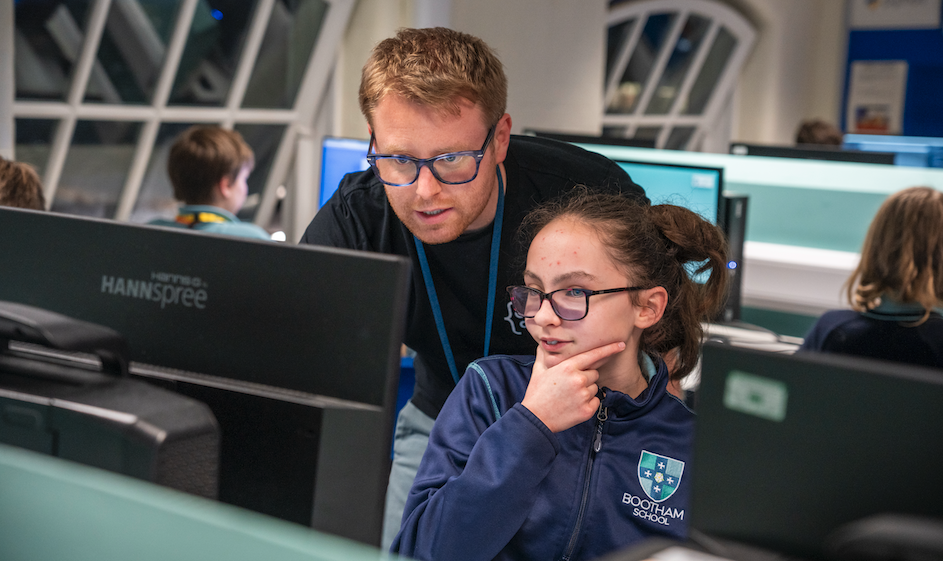

## Introduction

This course will support those involved in managing and running a Code Club to recruit volunteer mentors. Once completed, you should:
- Understand what tasks mentors can help with
- Know how to create mentor role description
- Have learnt where and how to recruit potential mentor
- Know what resources are available to help recruit mentors

Throughout the course, tasks are marked by a green background and a grey checkbox in the top-right corner. Take notes to assist your learning!

## Reflect on your experience
Before looking for new mentors, it is worth reflecting on how you heard about and became involved in Code Club. 

--- task ---

**Think** about what motivated you to volunteer. Note down what made your experience rewarding, or challenging. 

--- /task ---

--- task ---

**Consider** how you can use your experience to make a new mentor’s journey a positive experience.

--- /task ---

## Reflect on your clubs needs

Code Clubs benefit from having volunteers with diverse backgrounds, skills, and experiences.

Your club might need mentors to help with:
+ Setting up the space and computers
+ Talking to young people to guide them to find solutions for themselves
+ Gathering suitable learning resources and projects
+ Organising snacks and refreshments for longer sessions
+ Fundraising or organising events
+ Technical support for more complex coding languages 

--- no-print ---
--- task ---

  
**Reflect** on what skills your Code Club already has available.

--- /task ---
--- task ---

  
**Ask** the mentors you already have if they would be interested in upskilling or completing different tasks as part of their role.

--- /task ---
--- task ---

  
**Decide** what skills or roles are still needed, and whether having surplus mentors on standby if someone can’t attend would be useful.

--- /task ---

## How many mentors do I need?
The number of mentors will depend on how many young people attend your sessions, and the type of activities you are doing. Hands-on activities such as physical computing may require more volunteer support.

  We recommend a ratio of **one mentor to every eight children**.
 

--- /no-print ---

Before discussing a volunteer opportunity with someone, it can be useful to have an outline of what you want the mentor to do, and the benefits of mentoring in mind. Developing a **role description** can be useful for this.

